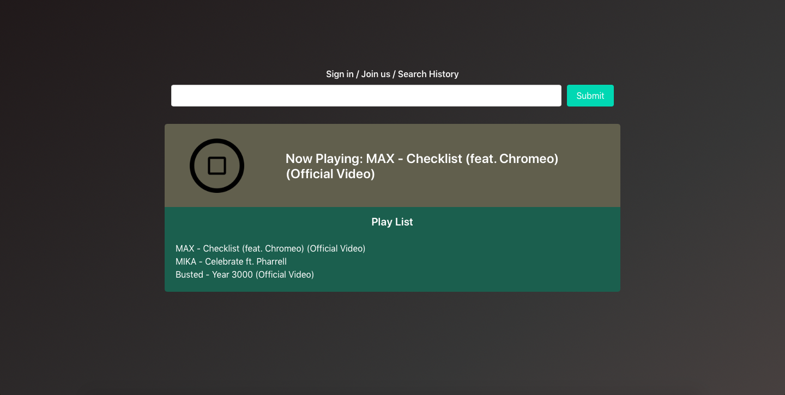
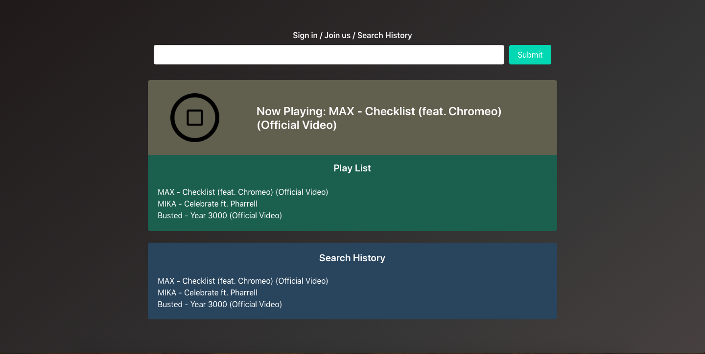

# Stream Your Music
  * A free music streaming website in which users can search and listen to any music they want.

## Introduction
  * This website was designed and developed as a part of the final project for Comp426 (Advanced Web Programming).

  * 유투브 api data 하루 할당량 다쓰면 끗남
  * Backend 로직 막아놨음. (깃헙에 올려야되서, static version으로 바꿈)
  * 사용법, 스크린샷 올리기

## Screenshots

</img>
</img>

## Used Technologies
  * Language: HTML, CSS, and JavaScript
  * CSS Framework: Bulma
  * JavaScript Library: jQuery, and jQuery UI
  * 3rd Part API: YouTube API

## Links
  * Demo video - https://youtu.be/qyUT4F7xRfA
  * Website published at - https://chansun.github.io/stream-your-music/
