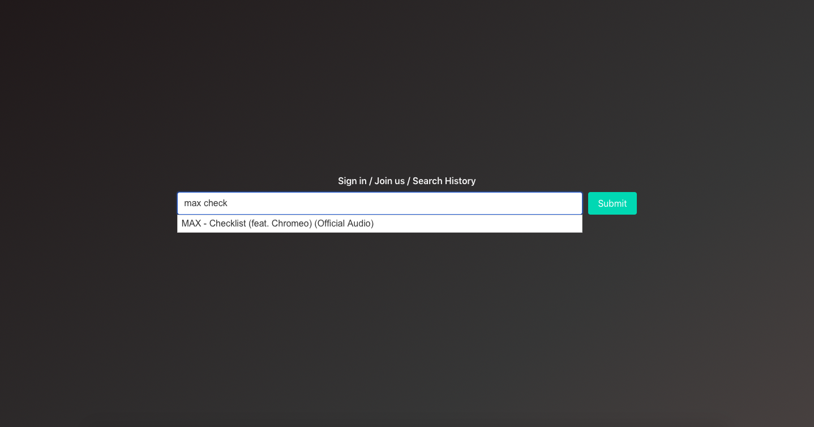
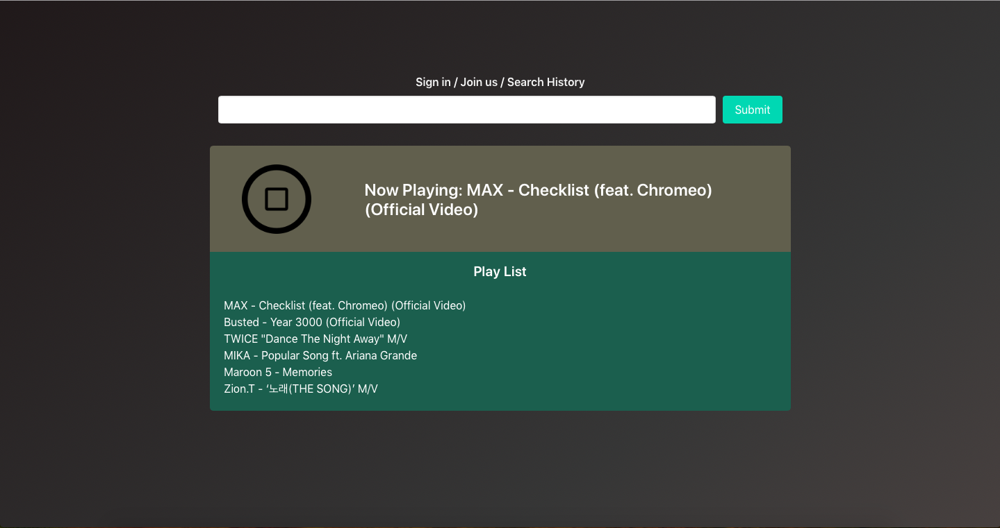
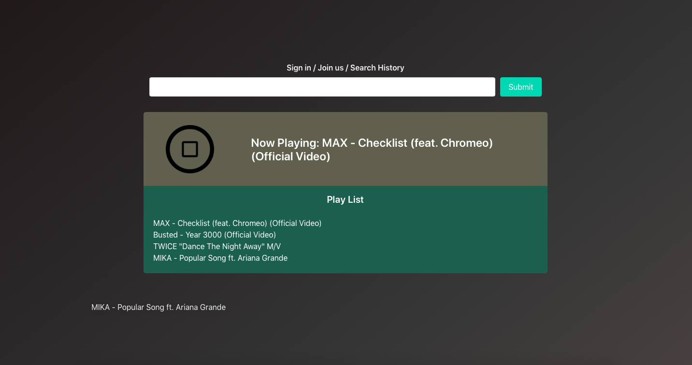
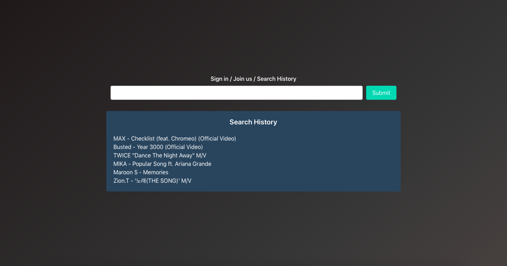

# Stream Your Music
  * Stream Your Music is a free music streaming website in which users can search and listen to any music they want.

## Introduction
  * The website was developed as a part of the final project for Comp426 (Advanced Web Programming), a computer science course at UNC-Chapel Hill.

## Screenshots

</img>
</img>
</img>
</img>
</img>
</img>

## How to use
  * Search a song using the autocomplete suggestion in the search box.
  * Click the submit button to add the song to the playlist.
  * Click the play button to play the song that is currently in the music player.
  * Click the title of the song in the playlist to put it into the music player.
  * Drag the title of the song in the playlist to remove it from the playlist.
  * Click the "Search History" tab to retrieve the search history.

## Notes
  * The original website used for the final project for Comp426 included backend serivce (e.g., creating an account, logging in with the account, and deleting the account). However, the one uploaded here is a static version of it so such backend service is unavailable here.
  * The website relies on YouTube videos. Upon the search request for a song from users, the website fetches the corresponding YouTube video to the website using Youtube API. Then, the website removes the video part and only leaves the audio part. This way, the website works like a music streaming website. However, because the website consumes YouTube API data every time users search a song, there is a limited number of queries that users can make per day. Once the YouTube API data runs out for the day, the searching service becomes instantly unavailable.

## Technologies used
  * Language: HTML, CSS, and JavaScript
  * CSS Framework: Bulma
  * JavaScript Library: jQuery and jQuery UI
  * 3rd Part API: YouTube API

## Links
  * Demo video - https://youtu.be/qyUT4F7xRfA
  * Static version published at - https://chansun.github.io/stream-your-music/